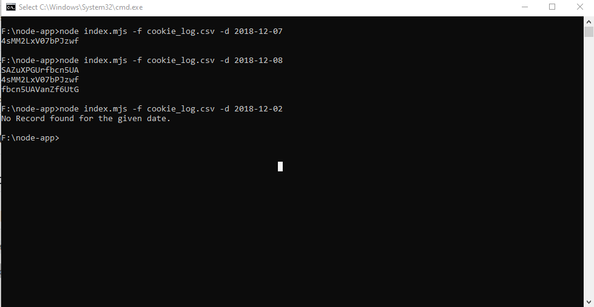
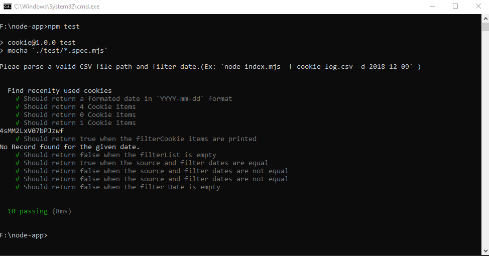

### Get recent cookies


## Install the latest version of [node js](https://nodejs.org/en/download/) and navigate to the project folder

```sh
  cd node-app
 ```
### Prerequisites
### Install NPM packages

```sh
  npm install
```
### Start app

 ```sh
  node index.mjs -f cookie_log.csv -d 2018-12-09
 ```



## Run unit test
```sh
  npm test
 ```




